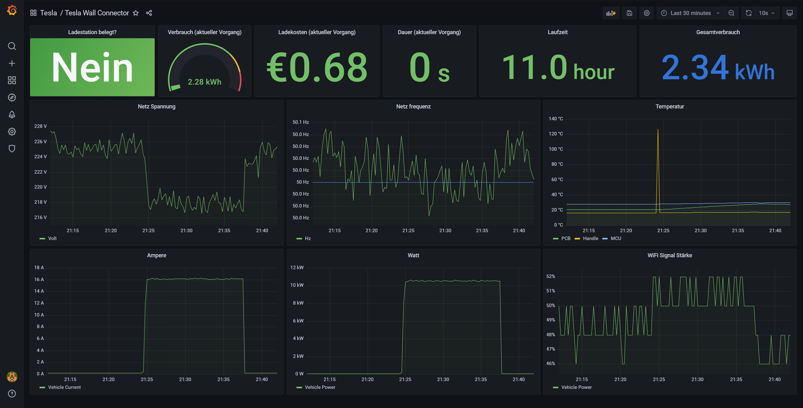

# teslawallconnector-exporter v0.2

Prometheus exporter for Tesla Wall Connector Gen 3 with Grafana Dashboard.

Usage: ./teslawallconnector-exporter.py &lt;internal IP of wall connector&gt;

The exporter will listen on localhost:3225, Scape this in your Prometheus.

To run the Exporter as a Service use the teslawallbox-exporter.service File.

Dashboard in Grafana:

