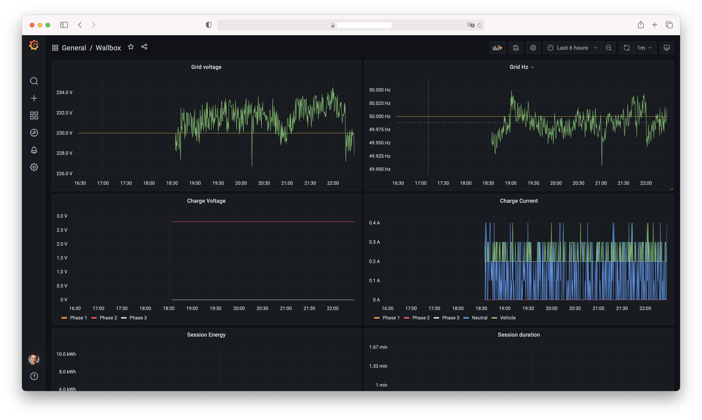

# Forked from marcsowen/teslawallconnector-exporter

# teslawallconnector-exporter

Prometheus exporter for Tesla Wall Connector Gen 3.

Usage: ./teslawallconnector-exporter.py &lt;internal IP of wall connector&gt;

The exporter will listen on localhost:3225

Example dashboard in Grafana:

